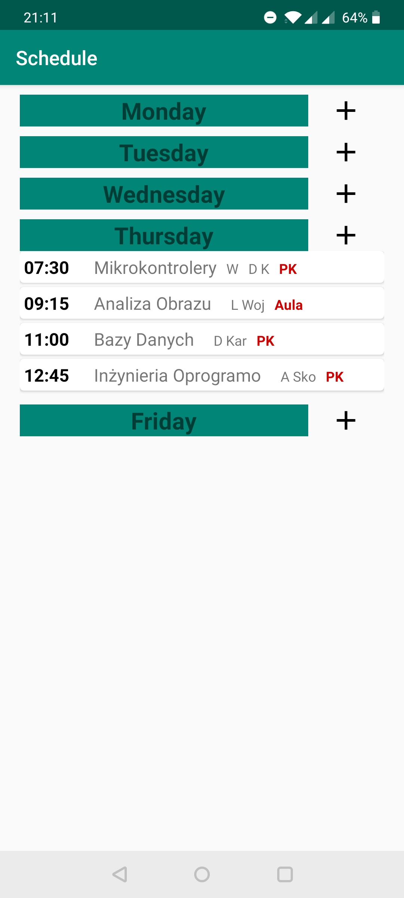
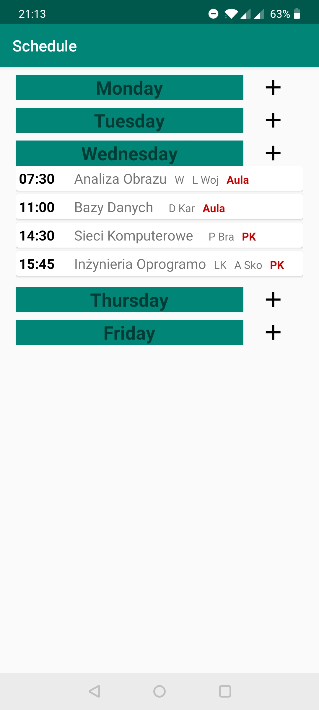
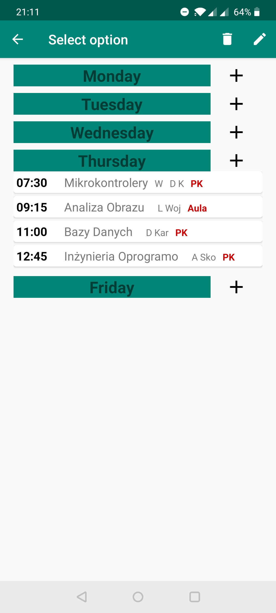
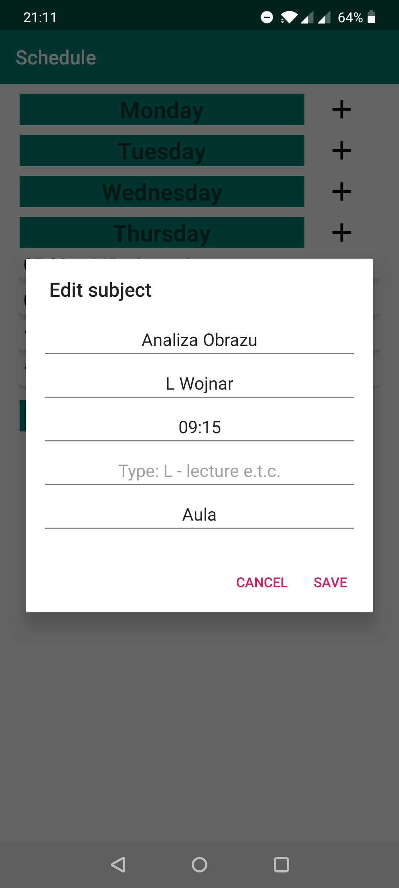
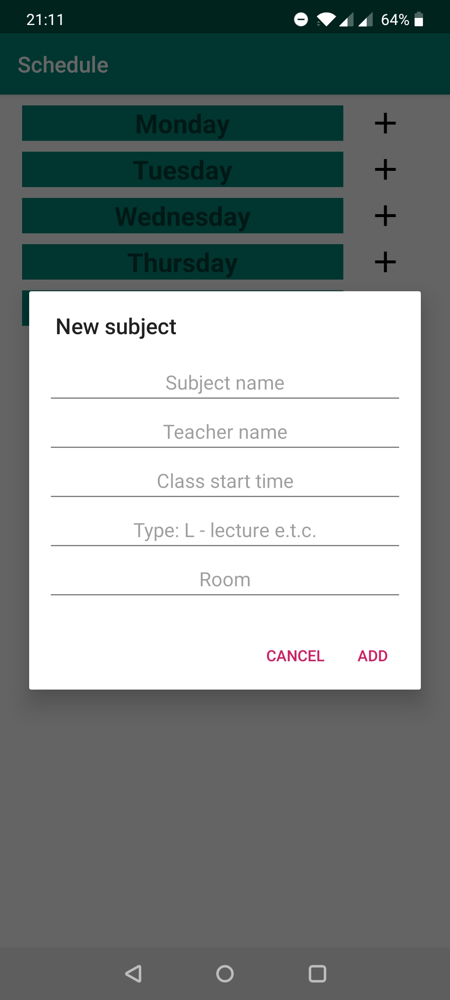

# Student_planner

Student planner app made as my university project.
The student's planner allows the user to save all the classes in one place.
Data is synchronized in real time with an external server and signed with a unique device identifier.
So no registration is required and the data is stored securely without the risk of losing it.

 

## The planner allows you to add: 
* type of class
* place
* teacher
* standard name of the class
* start time of the class

  

<strong>lang:</strong> ENG / PL
